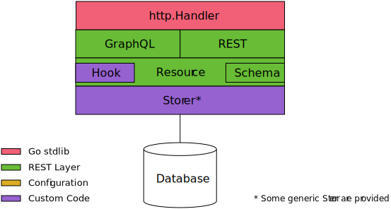

# REST Layer

REST APIs made easy.

[](https://godoc.org/github.com/rs/rest-layer) [](https://raw.githubusercontent.com/rs/rest-layer/master/LICENSE) [](https://travis-ci.org/rs/rest-layer) [](https://goreportcard.com/report/github.com/rs/rest-layer) <iframe src="https://ghbtns.com/github-btn.html?user=rs&repo=rest-layer&type=star&count=true" frameborder="0" scrolling="0" width="170px" height="20px"></iframe>


REST Layer is an API framework heavily inspired by the excellent [Python Eve](http://python-eve.org). It helps you create a comprehensive, customizable, and secure REST (graph) API on top of pluggable [backend storages](#storage-handlers) with no boiler plate code so you can focus on your business logic.

Implemented as a `net/http` handler, it plays well with standard middleware like [CORS](http://github.com/rs/cors). It is also [net/context](https://godoc.org/golang.org/x/net/context) aware thanks to [xhandler](https://github.com/rs/xhandler). This allows deadline management to be supported down to the storage and permit an easy extensibility by passing custom data between layers of the framework.

REST Layer is an opinionated framework. Unlike many API frameworks, you don't directly control the routing and you don't have to write handlers. You just define resources and sub-resources with a [schema](#resource-configuration), the framework automatically figures out what routes need to be generated behind the scene. You don't have to take care of the HTTP headers and response, JSON encoding, etc. either. REST layer handles HTTP [conditional requests](#conditional-requests), caching, [integrity checking](#data-integrity-and-concurrency-control) for you.

A powerful and extensible [validation engine](#resource-configuration) make sure that data comes pre-validated to your [custom storage handlers](#data-storage-handler). Generic resource handlers for [MongoDB](http://github.com/rs/rest-layer-mongo), [ElastiSearch](http://github.com/rs/rest-layer-es) and other databases are also available so you have few to no code to write to get up and running.

Moreover, REST Layer let you create a graph API by linking resources between them. Thanks to its advanced [field selection](#field-selection) syntax or [GraphQL](#graphql) support, you can gather resources and their dependencies in a single request, saving you from costly network roundtrips.

The REST Layer framework is composed of several sub-packages:



| Package                                                         | Coverage                                                                                                                                       | Description
| --------------------------------------------------------------- | ---------------------------------------------------------------------------------------------------------------------------------------------- | ------------
| [rest](https://godoc.org/github.com/rs/rest-layer/rest)         | [](http://gocover.io/github.com/rs/rest-layer/rest?version=1.6) | A `net/http` handler to expose a RESTful API.
| [graphql](https://godoc.org/github.com/rs/rest-layer/graphql)   | [](http://gocover.io/github.com/rs/rest-layer/graphql)              | A `net/http` handler to expose your API using the GraphQL protocol.
| [schema](https://godoc.org/github.com/rs/rest-layer/schema)     | [](http://gocover.io/github.com/rs/rest-layer/schema)               | A validation framework for the API resources.
| [resource](https://godoc.org/github.com/rs/rest-layer/resource) | [](http://gocover.io/github.com/rs/rest-layer/resource)             | Defines resources, manages the resource graph and manages the interface with resource storage handler.

# Documentation

- [Features](#features)
	- [Extensions](#extensions)
	- [Storage Handlers](#storage-handlers)
- [Usage](#usage)
- [Resource Configuration](#resource-configuration)
	- [Schema](#schema)
    - [Field Definition](#field-definition)
	- [Binding](#binding)
	- [Modes](#modes)
    - [Hooks](#hooks)
	- [Sub Resources](#sub-resources)
	- [Dependency](#dependency)
- [Filtering](#filtering)
- [Sorting](#sorting)
- [Field Selection](#field-selection)
	- [Field Aliasing](#field-aliasing)
	- [Field Parameters](#field-parameters)
	- [Embedding](#embedding)
- [Pagination](#pagination)
- [Conditional Requests](#conditional-requests)
- [Data Integrity & Concurrency Control](#data-integrity-and-concurrency-control)
- [Data Validation](#data-validation)
	- [Nullable Values](#nullable-values)
	- [Extensible Data Validation](#extensible-data-validation)
- [Timeout and Request Cancellation](#timeout-and-request-cancellation)
- [Logging](#logging)
- [Data Storage Handler](#data-storage-handler)
- [Custom Response Formatter / Sender](#custom-response-formatter-sender)
- [GraphQL](#graphql)
- [Hystrix](#hystrix)

## Features

- [x] Automatic handling of REST resource operations
- [ ] Full test coverage
- [x] Plays well with other `net/http` middleware
- [x] Pluggable resources storage
- [x] Pluggable response sender
- [x] GraphQL query support
- [ ] GraphQL mutation support
- [ ] Swagger Documentation
- [ ] Testing framework
- [x] Sub resources
- [ ] Cascading deletes on sub resources
- [x] Filtering
- [x] Sorting
- [x] Pagination
- [x] Aliasing
- [x] Custom business logic
- [x] Event hooks
- [x] Field hooks
- [x] Extensible data validation and transformation
- [x] Conditional requests (Last-Modified / Etag)
- [x] Data integrity and concurrency control (If-Match)
- [x] Timeout and request cancellation thru [net/context](https://godoc.org/golang.org/x/net/context)
- [x] Logging
- [x] Multi-GET
- [ ] Bulk inserts
- [x] Default and nullable values
- [ ] Per resource cache control
- [ ] Customizable authentication / authorization
- [x] Projections
- [x] Embedded resource serialization
- [x] Sub-request concurrency control
- [x] Custom ID field
- [ ] Data versioning
- [x] Per resource circuit breaker using [Hystrix](https://godoc.org/github.com/afex/hystrix-go/hystrix)

### Extensions

As REST Layer is a simple `net/http` handler. You can use standard middleware to extend its functionalities:

- [x] [CORS](http://github.com/rs/cors)
- [ ] Method Override
- [ ] Gzip, Deflate
- [ ] JSONP
- [x] [X-Forwarded-For](https://github.com/sebest/xff)
- [x] [Rate Limiting](https://github.com/didip/tollbooth)
- [ ] Operations Log
- [x] [Hystrix storage handler wrapper](https://github.com/rs/rest-layer-hystrix)

### Storage Handlers

- [x] [Memory](http://github.com/rs/rest-layer-mem) (test only)
- [x] [MongoDB](http://github.com/rs/rest-layer-mongo)
- [x] [ElasticSearch](http://github.com/rs/rest-layer-es)
- [ ] Redis
- [ ] Google BigTable

## Usage

```go
package main

import (
	"log"
	"net/http"
	"net/url"

	"github.com/rs/cors"
	"github.com/rs/rest-layer-mem"
	"github.com/rs/rest-layer/resource"
	"github.com/rs/rest-layer/rest"
	"github.com/rs/rest-layer/schema"
	"github.com/rs/xhandler"
)

var (
	// Define a user resource schema
	user = schema.Schema{
		Description: `The user object`,
		Fields: schema.Fields{
			"id": {
				Required: true,
				// When a field is read-only, on default values or hooks can
				// set their value. The client can't change it.
				ReadOnly: true,
				// This is a field hook called when a new user is created.
				// The schema.NewID hook is a provided hook to generate a
				// unique id when no value is provided.
				OnInit: schema.NewID,
				// The Filterable and Sortable allows usage of filter and sort
				// on this field in requests.
				Filterable: true,
				Sortable:   true,
				Validator: &schema.String{
					Regexp: "^[0-9a-f]{24}$",
				},
			},
			"created": {
				Required:   true,
				ReadOnly:   true,
				Filterable: true,
				Sortable:   true,
				OnInit:     schema.Now,
				Validator:  &schema.Time{},
			},
			"updated": {
				Required:   true,
				ReadOnly:   true,
				Filterable: true,
				Sortable:   true,
				OnInit:     schema.Now,
				// The OnUpdate hook is called when the item is edited. Here we use
				// provided Now hook which just return the current time.
				OnUpdate:  schema.Now,
				Validator: &schema.Time{},
			},
			// Define a name field as required with a string validator
			"name": {
				Required:   true,
				Filterable: true,
				Validator: &schema.String{
					MaxLen: 150,
				},
			},
		},
	}

	// Define a post resource schema
	post = schema.Schema{
		Description: `Represents a blog post`,
		Fields: schema.Fields{
			// schema.*Field are shortcuts for common fields
			// (identical to users' same fields)
			"id":      schema.IDField,
			"created": schema.CreatedField,
			"updated": schema.UpdatedField,
			// Define a user field which references the user owning the post.
			// See bellow, the content of this field is enforced by the fact
			// that posts is a sub-resource of users.
			"user": {
				Required:   true,
				Filterable: true,
				Validator: &schema.Reference{
					Path: "users",
				},
			},
			"published": {
				Filterable: true,
				Validator:  &schema.Bool{},
			},
			// Sub-documents are handled via a sub-schema
			"meta": {
				Schema: &schema.Schema{
					Fields: schema.Fields{
						"title": {
							Required: true,
							Validator: &schema.String{
								MaxLen: 150,
							},
						},
						"body": {
							// Dependency defines that body field can't be changed if
							// the published field is not "false".
							Dependency: schema.Q(`{"published": false}`),
							Validator: &schema.String{
								MaxLen: 100000,
							},
						},
					},
				},
			},
		},
	}
)

func main() {
	// Create a REST API resource index
	index := resource.NewIndex()

	// Add a resource on /users[/:user_id]
	users := index.Bind("users", user, mem.NewHandler(), resource.Conf{
		// We allow all REST methods
		// (rest.ReadWrite is a shortcut for []resource.Mode{resource.Create,
	    //  resource.Read, resource.Update, resource.Delete, resource,List})
		AllowedModes: resource.ReadWrite,
	})

	// Bind a sub resource on /users/:user_id/posts[/:post_id]
	// and reference the user on each post using the "user" field of the posts resource.
	posts := users.Bind("posts", "user", post, mem.NewHandler(), resource.Conf{
		// Posts can only be read, created and deleted, not updated
		AllowedModes: []resource.Mode{resource.Read, resource.List,
			 resource.Create, resource.Delete},
	})

	// Add a friendly alias to public posts
	// (equivalent to /users/:user_id/posts?filter={"published":true})
	posts.Alias("public", url.Values{"filter": []string{`{"published":true}`}})

	// Create API HTTP handler for the resource graph
	api, err := rest.NewHandler(index)
	if err != nil {
		log.Fatalf("Invalid API configuration: %s", err)
	}

	// Init a xhandler chain (see https://github.com/rs/xhandler)
	//
	// Note: You may choose to use REST layer without xhandler if you don't want
	// to inject anything to its `net/context`. REST Layer is compatible with
	// both approaches.
	c := xhandler.Chain{}

	// Add close notifier handler so context is cancelled when the client closes
	// the connection
	c.UseC(xhandler.CloseHandler)

	// Add timeout handler
	c.UseC(xhandler.TimeoutHandler(2 * time.Second))

	// Add CORS support with passthrough option on so rest-layer can still
	// handle OPTIONS method
	c.UseC(cors.New(cors.Options{OptionsPassthrough: true}).HandlerC)

	// Bind the API under /api/ path
	http.Handle("/api/", http.StripPrefix("/api/", c.Handler(api)))

	// Serve it
	log.Print("Serving API on http://localhost:8080")
	if err := http.ListenAndServe(":8080", nil); err != nil {
		log.Fatal(err)
	}
}
```

Just run this code (or use the provided [examples/demo](https://github.com/rs/rest-layer/blob/master/examples/demo/main.go)):

	> go run examples/demo/main.go
	2015/07/27 20:54:55 Serving API on http://localhost:8080

Using [HTTPie](http://httpie.org/), you can now play with your API.

First create a user:

```http
http POST :8080/api/users name="John Doe"

HTTP/1.1 201 Created
Content-Length: 155
Content-Location: /api/users/ar6ejgmkj5lfl98r67p0
Content-Type: application/json
Date: Mon, 27 Jul 2015 19:10:20 GMT
Etag: "1e18e148e1ff3ecdaae5ec03ac74e0e4"
Last-Modified: Mon, 27 Jul 2015 19:10:20 GMT
Vary: Origin

{
    "id": "ar6ejgmkj5lfl98r67p0",
    "created": "2015-07-27T21:10:20.671003126+02:00",
    "updated": "2015-07-27T21:10:20.671003989+02:00",
    "name": "John Doe",
}
```

As you can see, the `id`, `created` and `updated` fields have been automatically generated by our `OnInit` field hooks.

Also notice the `Etag` and `Last-Modified` headers. Those guys allow data integrity and concurrency control *down to the storage layer* through the use of the `If-Match` and `If-Unmodified-Since` headers. They can also serve for conditional requests using `If-None-Match` and `If-Modified-Since` headers.

Here is an example of conditional request:

```http
http :8080/api/users/ar6ejgmkj5lfl98r67p0 \
  If-Modified-Since:"Mon, 27 Jul 2015 19:10:20 GMT"

HTTP/1.1 304 Not Modified
Date: Mon, 27 Jul 2015 19:17:11 GMT
Vary: Origin
```

And here is a data integrity request following the [RFC-5789](http://tools.ietf.org/html/rfc5789) recommendations:

```http
http PATCH :8080/api/users/ar6ejgmkj5lfl98r67p0 \
  name="Someone Else" If-Match:invalid-etag

HTTP/1.1 412 Precondition Failed
Content-Length: 58
Content-Type: application/json
Date: Mon, 27 Jul 2015 19:33:27 GMT
Vary: Origin

{
    "code": 412,
    "fields": null,
    "message": "Precondition Failed"
}
```

Retry with the valid etag:

```http
http PATCH :8080/api/users/ar6ejgmkj5lfl98r67p0 \
  name="Someone Else" If-Match:'"1e18e148e1ff3ecdaae5ec03ac74e0e4"'

HTTP/1.1 200 OK
Content-Length: 159
Content-Type: application/json
Date: Mon, 27 Jul 2015 19:36:19 GMT
Etag: "7bb7a71b0f66197aa07c4c8fc9564616"
Last-Modified: Mon, 27 Jul 2015 19:36:19 GMT
Vary: Origin

{
    "created": "2015-07-27T21:33:09.168492448+02:00",
    "id": "ar6ejmukj5lflde9q8bg",
    "name": "Someone Else",
    "updated": "2015-07-27T21:36:19.904545093+02:00"
}
```

Note that even if you don't use conditional request, the `Etag` is always used by the storage handler to manage concurrency control between requests.

Another cool thing is sub-resources. We've set our `posts` resource as a child of the `users` resource. This way we can handle ownership very easily as routes are constructed as `/users/:user_id/posts`.

Lets create a post:

```http
http POST :8080/api/users/ar6ejgmkj5lfl98r67p0/posts \
  meta:='{"title":"My first post"}'

HTTP/1.1 200 OK
Content-Length: 212
Content-Type: application/json
Date: Mon, 27 Jul 2015 19:46:55 GMT
Etag: "307ae92df6c3dd54847bfc7d72422e07"
Last-Modified: Mon, 27 Jul 2015 19:46:55 GMT
Vary: Origin

{
    "created": "2015-07-27T21:46:55.355857401+02:00",
    "id": "ar6ejs6kj5lflgc28es0",
    "meta": {
        "title": "My first post"
    },
    "updated": "2015-07-27T21:46:55.355857989+02:00",
    "user": "ar6ejgmkj5lfl98r67p0"
}
```

Notice how the `user` field has been set with the user id provided in the route, that's pretty cool, huh?

We defined that we can create posts but we can't modify them, lets verify that:

```http
http PATCH :8080/api/users/821d…/posts/ar6ejs6kj5lflgc28es0 \
  private=true

HTTP/1.1 405 Method Not Allowed
Content-Length: 53
Content-Type: application/json
Date: Mon, 27 Jul 2015 19:50:33 GMT
Vary: Origin

{
    "code": 405,
    "fields": null,
    "message": "Invalid method"
}
```

Let's list posts for that user now:

```http
http :8080/api/users/ar6ejgmkj5lfl98r67p0/posts
HTTP/1.1 200 OK
Content-Length: 257
Content-Type: application/json
Date: Mon, 27 Jul 2015 19:51:46 GMT
Vary: Origin
X-Page: 1
X-Total: 1

[
    {
        "_etag": "307ae92df6c3dd54847bfc7d72422e07",
        "created": "2015-07-27T21:46:55.355857401+02:00",
        "id": "ar6ejs6kj5lflgc28es0",
        "meta": {
            "title": "My first post"
        },
        "updated": "2015-07-27T21:46:55.355857989+02:00",
        "user": "ar6ejgmkj5lfl98r67p0"
    }
]
```

Notice the added `_etag` field. This is to let you get etags of multiple items without having to `GET` each one of them throught individual requests.

Now, let's get user's information for each posts in a single request:

```http
http :8080/api/users/ar6ejgmkj5lfl98r67p0/posts fields=='id,meta{title},user{id,name}'
HTTP/1.1 200 OK
Content-Length: 257
Content-Type: application/json
Date: Mon, 27 Jul 2015 19:51:46 GMT
Vary: Origin
X-Page: 1
X-Total: 1

[
    {
        "_etag": "307ae92df6c3dd54847bfc7d72422e07",
        "created": "2015-07-27T21:46:55.355857401+02:00",
        "id": "ar6ejs6kj5lflgc28es0",
        "meta": {
            "title": "My first post"
        },
        "updated": "2015-07-27T21:46:55.355857989+02:00",
        "user": {
            "id": "ar6ejgmkj5lfl98r67p0",
            "name": "John Doe"
        }
    }
]
```

Notice how we selected which fields we wanted in the result using the [field selection](#field-selection) query format. Thanks to sub-request support, the user name is included with each post with no additional HTTP request.

We can go even further and embed a sub-request list responses. Let's say we want a list of users with the last two posts:

```http
http GET :8080/api/users fields='id,name,posts(limit:2){id,meta{title}}'

HTTP/1.1 201 Created
Content-Length: 155
Content-Location: /api/users/ar6ejgmkj5lfl98r67p0
Content-Type: application/json
Date: Mon, 27 Jul 2015 19:10:20 GMT
Etag: "1e18e148e1ff3ecdaae5ec03ac74e0e4"
Last-Modified: Mon, 27 Jul 2015 19:10:20 GMT
Vary: Origin

[
    {
        "id": "ar6ejgmkj5lfl98r67p0",
        "name": "John Doe",
        "posts": [
            {
                "id": "ar6ejs6kj5lflgc28es0",
                "meta": {
                    "title": "My first post"
                }
            },
            {
                "id": "ar6ek26kj5lfljgh84qg",
                "meta": {
                    "title": "My second post"
                }
            }
        ]
    }
]
```

Sub-requests are executed concurrently whenever possible to ensure the fastest response time.

## Resource Configuration

For REST Layer to be able to expose resources, you have to first define what fields the resource contains and where to bind it in the REST API URL namespace.

### Schema

Resource field configuration is performed throught the [schema](https://godoc.org/github.com/rs/rest-layer/schema) package. A schema is a struct describing a resource. A schema is composed of metadata about the resource and a description of the allowed fields through a map of field name pointing to field definition.

Sample resource schema:

```go
foo = schema.Schema{
	Description: "A foo object"
    Fields: schema.Fields{
        "field_name": {
            Required: true,
            Filterable: true,
            Validator: &schema.String{
                MaxLen: 150,
            },
        },
    },
}
```

Schema fields:

| Field         | Description
| ------------- | -------------
| `Description` | The description of the resource. This is used for API documentation.
| `Fields`      | A map of field name to field definition.

### Field Definition

The field definitions contains the following properties:

| Field        | Description
| ------------ | -------------
| `Required`   | If `true`, the field must be provided when the resource is created and can't be set to `null`. The client may be able to omit a required field if a `Default` or a hook sets its content.
| `ReadOnly`   | If `true`, the field can not be set by the client, only a `Default` or a hook can alter its value. You may specify a value for a read-only field in your mutation request if the value is equal to the old value, REST Layer won't complain about it. This let your client to `PUT` the same document it has `GET` without having to take care of removing the read-only fields.
| `Hidden`     | Hidden allows writes but hides the field's content from the client. When this field is enabled, PUTing the document without the field would not remove the field but use the previous document's value if any.
| `Default`    | The value to be set when resource is created and the client didn't provide a value for the field. The content of this variable must still pass validation.
| `OnInit`     | A function to be executed when the resource is created. The function gets the current value of the field (after `Default` has been set if any) and returns the new value to be set.
| `OnUpdate`   | A function to be executed when the resource is updated. The function gets the current (updated) value of the field and returns the new value to be set.
| `Params`     | Params defines the list of parameters allowed for this field. See [Field Parameters](#field-parameters) section for some examples.
| `Handler`    | Handler defines a function able to change the field's value depending on the passed parameters. See [Field Parameters](#field-parameters) section for some examples.
| `Validator`  | A `schema.FieldValidator` to validate the content of the field.
| `Dependency` | A query using `filter` format created with ``schema.Q(`{"field": "value"}`)``. If the query doesn't match the document, the field generates a dependency error.
| `Filterable` | If `true`, the field can be used with the `filter` parameter. You may want to ensure the backend database has this field indexed when enabled. Some storage handlers may not support all the operators of the filter parameter, see their documentation for more information.
| `Sortable`   | If `true`, the field can be used with the `sort` parameter. You may want to ensure the backend database has this field indexed when enabled.
| `Schema`     | An optional sub schema to validate hierarchical documents.

REST Layer comes with a set of validators. You can add your own by implementing the `schema.FieldValidator` interface. Here is the list of provided validators:

| Validator               | Description
| ----------------------- | -------------
| [schema.String][str]    | Ensures the field is a string
| [schema.Integer][int]   | Ensures the field is an integer
| [schema.Float][float]   | Ensures the field is a float
| [schema.Bool][bool]     | Ensures the field is a Boolean
| [schema.Array][array]   | Ensures the field is an array
| [schema.Dict][dict]     | Ensures the field is a dict
| [schema.Time][time]     | Ensures the field is a datetime
| [schema.URL][url]       | Ensures the field is a valid URL
| [schema.IP][url]        | Ensures the field is a valid IPv4 or IPv6
| [schema.Password][pswd] | Ensures the field is a valid password and bcrypt it
| [schema.Reference][ref] | Ensures the field contains a reference to another _existing_ API item
| [schema.AnyOf][any]     | Ensures that at least one sub-validator is valid
| [schema.AllOf][all]     | Ensures that at least all sub-validators are valid

[str]:   https://godoc.org/github.com/rs/rest-layer/schema#String
[int]:   https://godoc.org/github.com/rs/rest-layer/schema#Integer
[float]: https://godoc.org/github.com/rs/rest-layer/schema#Float
[bool]:  https://godoc.org/github.com/rs/rest-layer/schema#Bool
[array]: https://godoc.org/github.com/rs/rest-layer/schema#Array
[dict]:  https://godoc.org/github.com/rs/rest-layer/schema#Dict
[time]:  https://godoc.org/github.com/rs/rest-layer/schema#Time
[url]:   https://godoc.org/github.com/rs/rest-layer/schema#URL
[ip]:    https://godoc.org/github.com/rs/rest-layer/schema#IP
[pswd]:  https://godoc.org/github.com/rs/rest-layer/schema#Password
[ref]:   https://godoc.org/github.com/rs/rest-layer/schema#Reference
[any]:   https://godoc.org/github.com/rs/rest-layer/schema#AnyOf
[all]:   https://godoc.org/github.com/rs/rest-layer/schema#AllOf

Some common hook handler to be used with `OnInit` and `OnUpdate` are also provided:

| Hook           | Description
| -------------- | -------------
| `schema.Now`   | Returns the current time ignoring the input (current) value.
| `schema.NewID` | Returns a unique identifier using [xid](https://github.com/rs/xid) if input value is `nil`.

Some common field configuration are also provided as variables:

| Field Config           | Description
| ---------------------- | -------------
| `schema.IDField`       | A required, read-only field with `schema.NewID` set as `OnInit` hook and a `schema.String` validator matching [xid](https://github.com/rs/xid) format.
| `schema.CreatedField`  | A required, read-only field with `schema.Now` set on `OnInit` hook with a `schema.Time` validator.
| `schema.UpdatedField`  | A required, read-only field with `schema.Now` set on `OnInit` and `OnUpdate` hooks with a `schema.Time` validator.
| `schema.PasswordField` | A hidden, required field with a `schema.Password` validator.

Here is an example of schema declaration:

```go
// Define a post resource schema
post = schema.Schema{
	Fields: schema.Fields{
		// schema.*Field are shortcuts for common fields (identical to users' same fields)
		"id":      schema.IDField,
		"created": schema.CreatedField,
		"updated": schema.UpdatedField,
		// Define a user field which references the user owning the post.
		// See bellow, the content of this field is enforced by the fact
		// that posts is a sub-resource of users.
		"user": {
			Required: true,
			Filterable: true,
			Validator: &schema.Reference{
				Path: "users",
			},
		},
		// Sub-documents are handled via a sub-schema
		"meta": {
			Schema: &schema.Schema{
				Fields: schema.Fields{
					"title": {
						Required: true,
						Validator: &schema.String{
							MaxLen: 150,
						},
					},
					"body": {
						Validator: &schema.String{
							MaxLen: 100000,
						},
					},
				},
			},
		},
	},
}
```

### Binding

Now you just need to bind this schema at a specific endpoint on the [resource.Index](https://godoc.org/github.com/rs/rest-layer/resource#Index) object:

```go
index := resource.NewIndex()
posts := index.Bind("posts", post, mem.NewHandler(), resource.DefaultConf)
```

This tells the `resource.Index` to bind the `post` schema at the `posts` endpoint. The resource collection URL is then `/posts` and item URLs are `/posts/<post_id>`.

The [resource.DefaultConf](https://godoc.org/github.com/rs/rest-layer/resource#pkg-variables) variable is a pre-defined [resource.Conf](https://godoc.org/github.com/rs/rest-layer/resource#Conf) type with sensible default. You can customize the resource behavior using a custom configuration.

The `resource.Conf` type has the following customizable properties:

| Property                 | Description
| ------------------------ | -------------
| `AllowedModes`           | A list of `resource.Mode` allowed for the resource.
| `PaginationDefaultLimit` | If set, pagination is enabled by default with a number of item per page defined here.

### Modes

REST Layer handles mapping of HTTP methods to your resource URLs automatically. With REST, there is two kind of resource URL pathes: collection and item URLs. Collection URLs (`/<resource>`) are pointing to the collection of items while item URL (`/<resource>/<item_id>`) points to a specific item in that collection. HTTP methods are used to perform [CRUDL](https://en.wikipedia.org/wiki/Create,_read,_update_and_delete) operations on those resource.

You can easily dis/allow operation on a per resource basis using `resource.Conf`'s `AllowedModes` property. The use of modes instead of HTTP methods in the configuration adds a layer of abstraction necessary to handle specific cases like `PUT` HTTP method performing a `create` if the specified item does not exist or a `replace` if it does. This gives you precise control of what you want to allow or not.

Modes are passed as configuration to resources as follow:

```go
users := index.Bind("users", user, mem.NewHandler(), resource.Conf{
	AllowedModes: []resource.Mode{resource.Read, resource.List, resource.Create, resource.Delete},
})
```

The following table shows how REST layer map CRUDL operations to HTTP methods and `modes`:


| Mode      | HTTP Method | Context    | Description
| --------- | ----------- | ---------- | -------------
| `Read`    | GET         | Item       | Get an individual item by its ID.
| `List`    | GET         | Collection | List/find items using filters and sorts.
| `Create`  | POST        | Collection | Create an item letting the system generate its ID.
| `Create`  | PUT         | Item       | Create an item by choosing its ID.
| `Update`  | PATCH       | Item       | Partially modify the item following [RFC-5789](http://tools.ietf.org/html/rfc5789).
| `Replace` | PUT         | Item       | Replace the item by a new on.
| `Delete`  | DELETE      | Item       | Delete the item by its ID.
| `Clear`   | DELETE      | Collection | Delete all items from the collection matching the context and/or filters.

Note on GraphQL support and modes: current implementation of GraphQL doesn't suport mutation. Thus only resources with `Read` and `List` modes will be exposed with GraphQL. Support for other modes will be added in the future.

### Hooks

Hooks are piece of code you can attach before or after an operation is performed on a resource. A hook is a Go type implementing one of the event handler interface below, and attached to a resource via the [Resource.Use](https://godoc.org/github.com/rs/rest-layer/resource#Resource.Use) method.

| Hook Interface         | Description
| ---------------------- | -------------
| [FindEventHandler]     | Defines a function called when the resource is listed with or without a query. Note that hook is called for both resource and item fetch as well a prior to updates and deletes.
| [FoundEventHandler]    | Defines a function called with the result of a find on resource.
| [GetEventHandler]      | Defines a function called when a get is performed on an item of the resource. Note: when multi-get is performed this hook is called for each items id individually. 
| [GotEventHandler]      | Defines a function called with the result of a get on a resource.
| [InsertEventHandler]   | Defines a function called before an item is inserted.
| [InsertedEventHandler] | Defines a function called after an item has been inserted.
| [UpdateEventHandler]   | Defines a function called before an item is updated.
| [UpdatedEventHandler]  | Defines a function called after an item has been updated.
| [DeleteEventHandler]   | Defines a function called before an item is deleted.
| [DeletedEventHandler]  | Defines a function called after an item has been deleted.
| [ClearEventHandler]    | Defines a function called before a resource is cleared.
| [ClearedEventHandler]  | Defines a function called after a resource has been cleared.

[FindEventHandler]:     https://godoc.org/github.com/rs/rest-layer/resource#FindEventHandler
[FoundEventHandler]:    https://godoc.org/github.com/rs/rest-layer/resource#FoundEventHandler
[GetEventHandler]:      https://godoc.org/github.com/rs/rest-layer/resource#GetEventHandler
[GotEventHandler]:      https://godoc.org/github.com/rs/rest-layer/resource#GotEventHandler
[InsertEventHandler]:   https://godoc.org/github.com/rs/rest-layer/resource#InsertEventHandler
[InsertedEventHandler]: https://godoc.org/github.com/rs/rest-layer/resource#InsertedEventHandler
[UpdateEventHandler]:   https://godoc.org/github.com/rs/rest-layer/resource#UpdateEventHandler
[UpdatedEventHandler]:  https://godoc.org/github.com/rs/rest-layer/resource#UpdatedEventHandler
[DeleteEventHandler]:   https://godoc.org/github.com/rs/rest-layer/resource#DeleteEventHandler
[DeletedEventHandler]:  https://godoc.org/github.com/rs/rest-layer/resource#DeletedEventHandler
[ClearEventHandler]:    https://godoc.org/github.com/rs/rest-layer/resource#ClearEventHandler
[ClearedEventHandler]:  https://godoc.org/github.com/rs/rest-layer/resource#ClearedEventHandler

All hooks functions get a `context.Context` as first argument. If a network call must be performed from the hook, the context's deadline must be respected. If a hook return an error, the whole request is aborted with that error.

You can also use the context to pass data to your hooks from a middleware executed before REST Layer. This can be used to manage authentication for instance. See [examples/auth](https://github.com/rs/rest-layer/blob/master/examples/auth/main.go) to see an example. 

### Sub Resources

Sub resources can be used to express a one-to-may parent-child relationship between two resources. A sub-resource is automatically filtered by it's parent on the field specified as second argument of the `Bind` method.

To create a sub-resource, you bind you resource on the object returned by the binding of the parent resource. For instance, here we bind a `comments` resource to a `posts` resource:

```go
posts := index.Bind("posts", post, mem.NewHandler(), resource.DefaultConf)
// Bind comment as sub-resource of the posts resource
posts.Bind("comments", "post", comment, mem.NewHandler(), resource.DefaultConf)
```

The second argument `"post"` defines the field in the `comments` resource that refers to the parent. This field must be present in the resource and the backend storage must support filtering on it. As a result, we get a new hierarchical route as follow:

	/posts/:post_id/comments[/:comment_id]

When performing a `GET` on `/posts/:post_id/comments`, it is like adding the filter `{"post":"<post_id>"}` to the request to comments resource.

Additionally, thanks to REST Layer's [embedding](#embedding), this relationship can be embedded in the parent object as a sub-query:

    /posts?fields=id,title,comments(limit=5,sort=-updated){id,user{id,name},message}

Here we would get all post with their respective 5 last comments embedded in the `comments` field of each post object with the user commenting to post embedded in each comment's sub-document:

```json
[
    {
        "id": "abc",
        "comments": [
            {
                "id": "def",
                "user": {
                    "id": "ghi",
                    "name": "John Doe",
                },
                "message": "Last comment"
            },
            ...
        ]
    },
    ...
]
```

See [embedding](#embedding) for more information.

### Dependency

Fields can depends on other fields in order to be changed. To configure dependency, set a filter on the `Dependency` property of the field using the [schema.Q()](https://godoc.org/github.com/rs/rest-layer/schema#Q) method.

In this example, the `body` field can't be changed if the `published` field is not set to `true`:

```go
post = schema.Schema{
	Fields: schema.Fields{
		"publishded": schema.Field{
			Validator:  &schema.Bool{},
		},
		"body": {
			Dependency: schema.Q(`{"published": true}`),
			Validator:  &schema.String{},
		},
	},
}
```

## Filtering

To filter resources, you use the `filter` query-string parameter. The format of the parameter is inspired the [MongoDB query format](http://docs.mongodb.org/manual/tutorial/query-documents/). The `filter` parameter can be used with `GET` and `DELETE` methods on collection URLs.

To use a resource field with the `filter` parameter, the field must be defined on the resource and the `Filterable` field property must be set to `true`. You may want to ensure the backend database has this field indexed when enabled.

To specify equality condition, use the query `{<field>: <value>}` to select all items with `<field>` equal `<value>`. REST Layer will complain with a `422` HTTP error if any field queried is not defined in the resource schema or is using an operator incompatible with field type (i.e.: `$lt` on a string field).

A query can specify conditions for more than one field. Implicitly, a logical `AND` conjunction connects the clauses so that the query selects the items that match all the conditions.

Using the the `$or` operator, you can specify a compound query that joins each clause with a logical `OR` conjunction so that the query selects the items that match at least one condition.

In the following example, the query document selects all items in the collection where the field `quantity` has a value greater than (`$gt`) `100` or the value of the `price` field is less than (`$lt`) `9.95`:

```json
{"$or": [{"quantity": {"$gt": 100}}, {"price": {"$lt": 9.95}}]}
```

Match on sub-fields is performed throught field path separated by dots. This example shows an exact match on the subfields `country` and `city` of the `address` sub-document:

```json
{"address.country": "France", "address.city": "Paris"}
```

Some operators can change the type of match. For instance `$in` can be used to match a field against several values. For instance, to select all items with the `type` field equal either `food` or `snacks`, use the following query:

```json
{"type": {"$in": ["food", "snacks"]}}
```

The opposite `$nin` is also available.

The following numeric comparisons operators are supported: `$lt`, `$lte`, `$gt`, `$gte`.

The `$exists` operator matches document containing the field, even if this field is `null`

```json
{"type": {"$exists": true}}
```

You can invert the operator by passing `false`.

### Filter operators

| Operator  | Usage                               | Description
| --------- | ----------------------------------- | ------------
| `$or`     | `{"$or": [{"a": "b"}, {"a": "c"}]}` | Join two clauses with a logical `OR` conjunction.
| `$in`     | `{"a": {"$in": ["b", "c"]}}`        | Match a field against several values.
| `$nin`    | `{"a": {"$nin": ["b", "c"]}}`       | Opposite of `$in`.
| `$lt`     | `{"a": {"$lt": 10}}`                | Fields value is lower than specified number.
| `$lte`    | `{"a": {"$lte": 10}}`               | Fields value is lower than or equal to the specified number.
| `$gt`     | `{"a": {"$gt": 10}}`                | Fields value is greater than specified number.
| `$gte`    | `{"a": {"$gte": 10}}`               | Fields value is greater than or equal to the specified number.
| `$exists` | `{"a": {"$exists": true}}`          | Match if the field is present (or not if set to `false`) in the item, event if `nil`.

*Some storage handlers may not support all operators. Refer to the storage handler's documentation for more info.*

## Sorting

Sorting is of resource items is defined throught the `sort` query-string parameter. The `sort` value is a list of resource's fields separated by comas (`,`). To invert a field's sort, you can prefix its name with a minus (`-`) character.

To use a resource field with the `sort` parameter, the field must be defined on the resource and the `Sortable` field property must be set to `true`. You may want to ensure the backend database has this field indexed when enabled.

Here we sort the result by ascending quantity and descending date:

	/posts?sort=quantity,-created

## Field Selection

REST APIs tend to grow over time. Resources get more and more fields to fulfill the needs for new features. But each time fields are added, all existing API clients automatically gets the additional cost. This tend to lead to huge wast of bandwidth and added latency due to the transfer of unnecessary data.

To workaround this issue, REST Layer provides a powerful fields selection (also named projection) system. If you provide the `fields` parameter with a list of fields for the resource you are interested in separated by comas, only those fields will be returned in the document:

```http
$ http -b :8080/api/users/ar6eimekj5lfktka9mt0 fields=='id,name'
{
    "id": "ar6eimekj5lfktka9mt0",
    "name": "John Doe"
}
```

If your document has sub-fields, you can use brackets to select sub-fields:

```http
$ http -b :8080/api/users/ar6eimekj5lfktka9mt0/posts fields=='meta{title,body}'
[
    {
        "_etag": "ar6eimukj5lfl07r0uv0",
        "meta": {
            "title": "test",
            "body": "example"
        }
    }
]
```

### Field Aliasing

It's also possible to rename fields in the response using aliasing. To create an alias, prefix the field name by the wanted alias separated by a colon (`:`):

```http
$ http -b :8080/api/users/ar6eimekj5lfktka9mt0 fields=='id,name,n:name'
{
    "id": "ar6eimekj5lfktka9mt0",
    "n": "John Doe",
    "name": "John Doe"
}
```

As you see, you can specify several time the same field. It's doesn't seem useful in this example, but with [fields parameters](#field-parameters), it becomes very powerful (see below).

Aliasing works with sub-fields as well:

```http
$ http -b :8080/api/users/ar6eimekj5lfktka9mt0/posts fields=='meta{title,b:body}'
[
    {
        "_etag": "ar6eimukj5lfl07r0uv0",
        "meta": {
            "title": "test",
            "b": "example"
        }
    }
]
```

### Field Parameters

Field parameters are used to apply a transformation on the value of a field using custom logic.

For instance, if you are using an on demand dynamic image resizer, you may want to expose the capability of this service, without requiring from the client to learn another URL based API. Wouldn't it be better if we could just ask the API to return the `thumbnail_url` dynamically transformed with the desired dimensions?

By combining field aliasing and field parameters, we can expose this resizer API as follow:

```http
$ http -b :8080/api/videos fields=='id,
                                    thumb_small_url:thumbnail_url(width:80,height:60),
                                    thumb_large_url:thumbnail_url(width:800,height:600)'
[
    {
        "_etag": "ar6eimukj5lfl07r0uv0",
        "thumb_small_url": "http://cdn.com/path/to/image-80w60h.jpg",
        "thumb_large_url": "http://cdn.com/path/to/image-800w600h.jpg"
    }
]
```

The example above show the same field represented twice but with some useful value transformations.

To add parameters on a field, use the `Params` property of the `schema.Field` type as follow:

```go
schema.Schema{
	Fields: schema.Fields{
		"field": {
			Params: schema.Params{
				"width": {
					Description: "Change the width of the thumbnail to the value in pixels",
					Validator: schema.Integer{}
				},
				"height": {
					Description: "Change the width of the thumbnail to the value in pixels",
					Validator: schema.Integer{},
				},
			},
			Handler: func(ctx context.Context, value interface{}, params map[string]interface{}) (interface{}, error) {
				// your transformation logic here
				return value, nil
			},
		},
	},
}
```

Only parameters listed in the `Params` field will be accepted. You `Handler` function is called with the current value of the field and parameters sent by the user if any. Your function can apply wanted transformations on the value and return it. If an error is returned, a `422` error will be triggered with your error message associated to the field.

### Embedding

With sub-fields notation you can also request referenced resources or connections (sub-resources). REST Layer will recognize them automatically and fetch the associated resources in order embed their data in the response. This can save a lot of unnecessary sequential roundtrips:

```http
$ http -b :8080/api/users/ar6eimekj5lfktka9mt0/posts \
  fields=='meta{title},user{id,name},comments(sort:"-created",limit:10){user{id,name},body}'
[
    {
        "_etag": "ar6eimukj5lfl07r0uv0",
        "meta": {
            "title": "test"
        },
        "user": {
            "id": "ar6eimul07lfae7r4b5l",
            "name": "John Doe"
        },
        "comments": [
            {
                "user": {
                    "id": "ar6emul0kj5lfae7reimu",
                    "name": "Paul Wolf"
                },
                "body": "That's awesome!"
            },
            ...
        ]
    },
    ...
]
```

In the above example, the `user` field is a reference on the `users` resource. REST Layer did fetch the user referenced by the post and embedded the requested sub-fields (`id` and `name`). Same for `comments`: `comments` is set as a sub-resource of the `posts` resource. With this syntax, it's easy to get the last 10 comments on the post in the same REST request. For each of those comment, we asked to embed the `user` field referenced resource with `id` and `name` fields again.

Notice the `sort` and `limit` parameters passed to the `comments` field. Those are field parameter automatically exposed by connections to let you control the embedded list order, filter and pagination. You can use `sort`, `filter`, `page` and `limit` parameters with those field with the same syntax as their top level query-string parameter counterpart.

Such request can quickly generate a lot of queries on the storage handler. To ensure a fast response time, REST layer tries to coalesce those storage requests and to execute them concurrently whenever possible.

## Pagination

Pagination is supported on collection URLs using `page` and `limit` query-string parameters. If you don't define a default pagination limit using `PaginationDefaultLimit` resource configuration parameter, the resource won't be paginated until you provide the `limit` query-string parameter.

If your collections are large enough, failing to define a reasonable `PaginationDefaultLimit` parameter may quickly render your API unusable.

## Conditional Requests

Each stored resource provides information on the last time it was updated (`Last-Modified`), along with a hash value computed on the representation itself (`ETag`). These headers allow clients to perform conditional requests by using the `If-Modified-Since` header:

```http
> http :8080/users/ar6ej4mkj5lfl688d8lg If-Modified-Since:'Wed, 05 Dec 2012 09:53:07 GMT'
HTTP/1.1 304 Not Modified
```

or the `If-None-Match` header:

```http
$ http :8080/users/ar6ej4mkj5lfl688d8lg If-None-Match:'"1234567890123456789012345678901234567890"'
HTTP/1.1 304 Not Modified
```

## Data Integrity and Concurrency Control

API responses include a `ETag` header which also allows for proper concurrency control. An `ETag` is a hash value representing the current state of the resource on the server. Clients may choose to ensure they update (`PATCH` or `PUT`) or delete (`DELETE`) a resource in the state they know it by providing the last known `ETag` for that resource. This prevents overwriting items with obsolete data.

Consider the following workflow:

```http
$ http PATCH :8080/users/ar6ej4mkj5lfl688d8lg If-Match:'"1234567890123456789012345678901234567890"' \
    name='John Doe'
HTTP/1.1 412 Precondition Failed
```

What went wrong? We provided a `If-Match` header with the last known `ETag`, but it’s value did not match the current `ETag` of the item currently stored on the server, so we got a 412 Precondition Failed.

When this happen, it's up to the client to decide to inform the user of the error and/or refetch the latest version of the document to get the lattest `ETag` before retrying the operation.

```http
$ http PATCH :8080/users/ar6ej4mkj5lfl688d8lg If-Match:'"80b81f314712932a4d4ea75ab0b76a4eea613012"' \
    name='John Doe'
HTTP/1.1 200 OK
Etag: "7bb7a71b0f66197aa07c4c8fc9564616"
Last-Modified: Mon, 27 Jul 2015 19:36:19 GMT
```

This time the update operation has been accepted and we've got a new `ETag` for the updated resource.

Concurrency control header `If-Match` can be used with all mutation methods on item URLs: `PATCH` (update), `PUT` (replace) and `DELETE` (delete).

## Data Validation

Data validation is provided out-of-the-box. Your configuration includes a schema definition for every resource managed by the API. Data sent to the API to be inserted/updated will be validated against the schema, and a resource will only be updated if validation passes. See [Field Definition](#field-definition) section to know more about how to configure your validators.

```http
> http  :8080/api/users name:=1 foo=bar
HTTP/1.1 422 status code 422
Content-Length: 110
Content-Type: application/json
Date: Thu, 30 Jul 2015 21:56:39 GMT
Vary: Origin

{
    "code": 422,
    "message": "Document contains error(s)",
    "issues": {
        "foo": [
            "invalid field"
        ],
        "name": [
            "not a string"
        ]
    }
}
```

In the example above, the document did not validate so the request has been rejected with description of the errors for each fields.

### Nullable Values

To allow `null` value in addition the field type, you can use [schema.AnyOf](https://godoc.org/github.com/rs/rest-layer/schema#AnyOf) validator:

```go
"nullable_field": {
	Validator: schema.AnyOf{
		schema.String{},
		schema.Null{},
	},
}
```

### Extensible Data Validation

It is very easy to add new validators. You just need to implement the [schema.FieldValidator](https://godoc.org/github.com/rs/rest-layer/schema#FieldValidator):

```go
type FieldValidator interface {
	Validate(value interface{}) (interface{}, error)
}
```

The `Validate` method takes the value as argument and must either return the value back with some eventual transformation or an `error` if the validation failed.

Your validator may also implement the optional [schema.Compiler](https://godoc.org/github.com/rs/rest-layer/schema#Compiler) interface:

```go
type Compiler interface {
	Compile() error
}
```

When a field validator implements this interface, the `Compile` method is called at the server initialization. It's a good place to pre-compute some data (i.e.: compile regexp) and verify validator configuration. If validator configuration contains issue, the `Compile` method must return an error, so the initialization of the resource will generate un fatal error.

Last but not least, a validator may implement some advanced serialization or transformation of the data to optimize it's storage. In order to read this data back and put it in a format suitable for JSON representation, a validator can implement the [schema.FieldSerializer](https://godoc.org/github.com/rs/rest-layer/schema#FieldSerializer) interface:

```go
type FieldSerializer interface {
	Serialize(value interface{}) (interface{}, error)
}
```

When a validator implements this interface, the method is called with the field's value just before JSON marshaling. You should return an error if the format stored in the db is invalid and can't be converted back into a suitable representation.

See [schema.IP](https://godoc.org/github.com/rs/rest-layer/schema#IP) validator for an implementation example.

## Timeout and Request Cancellation

REST Layer respects [net/context](https://golang.org/x/net/context) deadline from end to end. Timeout and request cancellation are thus handled throught `net/context`. By default no cancellation handling or per request timeout are defined. You can easily add them using [xhandler](https://github.com/rs/xhandler) provided handlers as follow:

```go
// Init a xhandler chain (see http://github.com/rs/xhandler)
c := xhandler.Chain{}

// Add close notifier handler so context is cancelled when the client closes
// the connection
c.UseC(xhandler.CloseHandler)

// Add timeout handler
c.UseC(xhandler.TimeoutHandler(2 * time.Second))

// Add other handlers like xlog, xaccess, cors (see examples)

// Bind the API under /api/ path
http.Handle("/api/", http.StripPrefix("/api/", c.Handler(api)))
```

When a request is stopped because the client closed the connection (context cancelled), the response HTTP status is set to `499 Client Closed Request` (for logging purpose). When a timeout is set and the request has reached this timeout, the response HTTP status is set to `509 Gateway Timeout`.

## Logging

Logging is performed using [xlog](https://github.com/rs/xlog). If `xlog` is not initialized, you won't get any logging out of REST Layer. With `xlog`, you can configure your logging outputs very precisely:

```go
// Install xlog logger
c.UseC(xlog.NewHandler(xlog.Config{
	// Log info level and higher
	Level: xlog.LevelInfo,
	// Set some global env fields
	Fields: xlog.F{
		"role": "my-service",
		"host": host,
	},
	// Output everything on console
	Output: xlog.NewOutputChannel(xlog.MultiOutput{
		// Send all logs with field type=mymodule to a remote syslog
		0: xlog.FilterOutput{
			Cond: func(fields map[string]interface{}) bool {
				return fields["type"] == "mymiddleware"
			},
			Output: xlog.NewSyslogOutput("tcp", "1.2.3.4:1234", "mymiddleware"),
		},
		// Setup different output per log level
		1: xlog.LevelOutput{
			// Send errors to the console
			Error: xlog.NewConsoleOutput(),
			// Send syslog output for error level
			Info: xlog.NewSyslogOutput("", "", ""),
		},
	}),
}))

// Log API access using xlog
c.UseC(xaccess.NewHandler())
```

See [xlog](https://github.com/rs/xlog) documentation for more info.

## Data Storage Handler

REST Layer doesn't handle storage of resources directly. A [mem.MemoryHandler](https://godoc.org/github.com/rs/rest-layer-mem#MemoryHandler) is provided as an example but should be used for testing only.

A resource storage handler is easy to write though. Some handlers for [popular databases are available](#storage-handlers), but you may want to write your own to put an API in front of anything you want. It is very easy to write a data storage handler, you just need to implement the [resource.Storer](https://godoc.org/github.com/rs/rest-layer/resource#Storer) interface:

```go
type Storer interface {
	Find(ctx context.Context, lookup *resource.Lookup, page, perPage int) (*resource.ItemList, error)
	Insert(ctx context.Context, items []*resource.Item) error
	Update(ctx context.Context, item *resource.Item, original *resource.Item) error
	Delete(ctx context.Context, item *resource.Item) error
	Clear(ctx context.Context, lookup *resource.Lookup) (int, error)
}
```

Mutation methods like `Update` and `Delete` must ensure they are atomically mutating the same item as specified in argument by checking their `ETag` (the stored `ETag` must match the `ETag` of the provided item). In case the handler can't guarantee that, the storage must be left untouched, and a [resource.ErrConflict](https://godoc.org/github.com/rs/rest-layer/resource#pkg-variables) must be returned.

If the operation is not immediate, the method must listen for cancellation on the passed `ctx`. If the operation is stopped due to context cancellation, the function must return the result of the [ctx.Err()](https://godoc.org/golang.org/x/net/context#Context) method. See [this blog post](https://blog.golang.org/context) for more information about how `net/context` works.

If the backend storage is able to efficiently fetch multiple document by their id, it can implement the optional [resource.MultiGetter](https://godoc.org/github.com/rs/rest-layer/resource#MultiGetter) interface. REST Layer will automatically use it whenever possible.

See [resource.Storer](https://godoc.org/github.com/rs/rest-layer/resource#Storer) documentation for more information on resource storage handler implementation details.

## Custom Response Formatter / Sender

REST Layer let you extend or replace the default response formatter and sender. To write a new response format, you need to implement the [rest.ResponseFormatter](https://godoc.org/github.com/rs/rest-layer/rest#ResponseFormatter) interface:

```go
// ResponseFormatter defines an interface responsible for formatting a the different types of response objects
type ResponseFormatter interface {
	// FormatItem formats a single item in a format ready to be serialized by the ResponseSender
	FormatItem(ctx context.Context, headers http.Header, i *resource.Item, skipBody bool) (context.Context, interface{})
	// FormatList formats a list of items in a format ready to be serialized by the ResponseSender
	FormatList(ctx context.Context, headers http.Header, l *resource.ItemList, skipBody bool) (context.Context, interface{})
	// FormatError formats a REST formated error or a simple error in a format ready to be serialized by the ResponseSender
	FormatError(ctx context.Context, headers http.Header, err error, skipBody bool) (context.Context, interface{})
}
```

You can also customize the response sender, responsible for the serialization of the formatted payload:

```go
// ResponseSender defines an interface responsible for serializing and sending the response
// to the http.ResponseWriter.
type ResponseSender interface {
	// Send serialize the body, sets the given headers and write everything to the provided response writer
	Send(ctx context.Context, w http.ResponseWriter, status int, headers http.Header, body interface{})
}
```

Then set your response formatter and sender on the REST Layer HTTP handler like this:

```go
api, _ := rest.NewHandler(index)
api.ResponseFormatter = &myResponseFormatter{}
api.ResponseSender = &myResponseSender{}
```

You may also extend the [DefaultResponseFormatter](https://godoc.org/github.com/rs/rest-layer/rest#DefaultResponseFormatter) and/or [DefaultResponseSender](https://godoc.org/github.com/rs/rest-layer/rest#DefaultResponseSender) if you just want to wrap or slightly modify the default behavior:

```go
type myResponseFormatter struct {
	rest.DefaultResponseFormatter
}

// Add a wrapper around the list with pagination info
func (r myResponseFormatter) FormatList(ctx context.Context, headers http.Header, l *resource.ItemList, skipBody bool) (context.Context, interface{}) {
	ctx, data := r.DefaultResponseSender.FormatList(ctx, headers, l, skipBody)
	return ctx, map[string]interface{}{
		"meta": map[string]int{
			"total": l.Total,
			"page":  l.Page,
		},
		"list": data,
	}
}
```

## GraphQL

In parallel of the REST API handler, REST Layer is also able to handle GraphQL queries (mutation will come later). GraphQL is a query language created by Facebook which provides a common interface fetch and manipulate data. REST Layer's GraphQL handler is able to read a [resource.Index](https://godoc.org/github.com/rs/rest-layer/resource#Index) and create a corresponding GraphQL schema.

GraphQL doesn't expose resources directly, but queries. REST Layer take all the resources defined at the root of the `resource.Index` and create two GraphQL queries for each one. On query is just the name of the endpoint, so `/users` would result in `users` and another is the name of the endpoint suffixed with `List`, as `usersList`. The item queries takes an `id` parameter and the list queries take `page`, `limit`, `filter` and `sort` parameters. All sub-resources are accessible using GraphQL sub-selection syntax.

If you resource defines aliases, some additional GraphQL queris are exposes with their name constructed as the name of the resource suffixed with the name of the alias with a capital. So for `users` with an alias `admin`, the query would be `usersAdmin`.

You can bind the GraphQL endpoint wherever you want as follow:

```go
index := resource.NewIndex()
// Bind some resources

h, err := graphql.NewHandler(index)
if err != nil {
	log.Fatal(err)
}
http.Handle("/graphql", h)
http.ListenAndServe(":8080", nil)
```

GraphQL support is experimental. Only querying is supported for now, mutation will come later. Sub-queries are executed sequentially and may generate quite a lot of query on the storage backend on complex queries. You may prefer the REST endpoint with [field selection](#field-selection) which benefits from a lot of optimization for now.

## Hystrix

REST Layer supports Hystrix as a circuit breaker. You can enable Hystrix on a per resource basis by wrapping the storage handler using [rest-layer-hystrix](https://github.com/rs/rest-layer-hystrix):

```go
import "github.com/rs/rest-layer-hystrix"

index.Bind("posts", post, restrix.Wrap("posts", mongo.NewHandler()), resource.DefaultConf)
```

When wrapped this way, one Hystrix command is created per storage handler action, with the name formatted as `<name>.<Action>`. Possible actions are:

- `Find`: when a collection of items is requested.
- `Insert`: when items are created.
- `Update`: when items are modified.
- `Delete`: when a single item is deleted by its id.
- `Clear`: when a collection of items matching a filter are deleted.
- `MultiGet`: when several items are retrieved by their ids (on storage handler supporting `MultiGetter` interface.

Once enabled, you must configure Hystrix for each command and start the Hystrix metrics stream handler.

See [Hystrix godoc](https://godoc.org/github.com/afex/hystrix-go/hystrix) for more info and `examples/hystrix/main.go` for a complete usage example with REST layer.

## Licenses

All source code is licensed under the [MIT License](https://raw.github.com/rs/rest-layer/master/LICENSE).